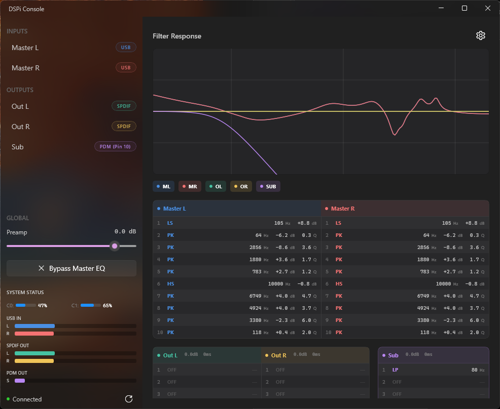

# DSPi Console for Windows

A WinUI 3 control application for the RP2040-based DSPi audio processor. This is a Windows port of the original macOS Swift application, now at full feature parity.



## Features

### DSP Control
- **Parametric EQ**: Up to 10 bands per channel with real-time coefficient updates
- **5 Audio Channels**:
  - Master L/R (USB inputs) - 10 EQ bands each
  - Out L/R (SPDIF outputs) - 10 EQ bands each
  - Sub (PDM output) - 10 EQ bands
- **Filter Types**: Off, Peaking, Low Shelf, High Shelf, Low Pass, High Pass
- **Per-Channel Delay**: 0-170ms delay for output channels (Sub and SPDIF)
- **Global Controls**: Preamp gain (-60 to +10 dB), Master EQ bypass

### AutoEQ Integration
- **Headphone Profile Browser**: Search and apply EQ profiles from the AutoEQ database (1000+ headphone models)
- **Favorites System**: Save frequently used profiles for quick access
- **Automatic Preamp Adjustment**: Applies recommended preamp gain with each profile

### Filter Import/Export
- **Import Filters**: Load filter configurations from text files
  - Supports DSPiConsole multi-channel format
  - Supports Room EQ Wizard (REW) format
- **Export Filters**: Save current configuration to file for backup or sharing
- **Channel Selection**: Choose which channels to apply imported filters to

### Parameter Persistence
- **Commit Parameters**: Save current settings to device flash memory
- **Revert to Saved**: Restore last saved parameters from device
- **Factory Reset**: Clear all active parameters to defaults

### Real-time Monitoring
- **Peak Meters**: Visual level indicators for all 5 channels
- **CPU Load**: Real-time display of both RP2040 cores
- **Live Bode Plot**: Hardware-accelerated frequency response visualization

### User Interface
- **Dashboard View**: Overview of all channels with filter summaries at a glance
- **Channel Editor**: Detailed filter editing with type selection and parameter controls
- **Desktop Acrylic Backdrop**: Modern translucent sidebar effect (Windows 10/11)
- **Channel Visibility Toggles**: Show/hide individual channels on the Bode plot
- **Color-coded Channels**: Distinct colors for easy identification

## Screenshots

The application features a modern dark theme with translucent sidebar:
- Left sidebar: Channel selection, global controls, meters, and connection status
- Main area: Bode plot with frequency response and filter editing panels

## Requirements

- Windows 10 version 1809 (build 17763) or later
- Windows 11 recommended for best Acrylic backdrop support
- Visual Studio 2022 with the following workloads:
  - .NET Desktop Development
  - Windows App SDK (C#)

## Building

1. Open `DSPiConsole.sln` in Visual Studio 2022
2. Select your target platform (x64, x86, or ARM64)
3. Build the solution (Ctrl+Shift+B)

For release builds:
```bash
dotnet build -c Release -r win-x64
```

## Usage

### Basic Operation

1. Connect your DSPi device via USB
2. Launch DSPi Console - it will automatically connect
3. Select a channel from the sidebar to edit its filters
4. Click a channel again to return to the dashboard view

### Applying AutoEQ Profiles

1. Click the settings gear icon (top right)
2. Select **AutoEQ → Browse Profiles...**
3. Search for your headphone model
4. Click **Apply** to load the profile to Master L/R channels
5. Optionally click the star to add to favorites

### Importing Filters

1. Click the settings gear icon
2. Select **Import Filters...**
3. Choose a `.txt` file (DSPiConsole or REW format)
4. Select which channels to apply the filters to

### Saving to Device

1. Make your desired adjustments
2. Click settings → **Commit Parameters...**
3. Confirm to save to flash (survives power cycles)

### Keyboard Shortcuts

| Shortcut | Action |
|----------|--------|
| Ctrl+I | Import Filters |
| Ctrl+E | Export Filters |
| Ctrl+S | Commit Parameters |
| Alt+F4 | Exit |

## Project Structure

```
DSPiConsole-Windows/
├── DSPiConsole.sln              # Solution file
├── README.md                    # This file
├── gui_specs.md                 # UI styling reference
├── DSPiConsole/                 # Main WinUI 3 application
│   ├── App.xaml(.cs)            # Application entry point & theme resources
│   ├── MainWindow.xaml(.cs)     # Main window with all UI
│   ├── autoeq_database.json     # AutoEQ headphone profiles
│   ├── Controls/                # Custom controls
│   │   ├── BodePlotControl.cs   # Frequency response graph (Win2D)
│   │   ├── HorizontalMeterBar.cs # Audio level meters
│   │   └── CpuMeter.cs          # CPU load display
│   ├── Converters/              # Value converters for XAML binding
│   ├── Dialogs/                 # Modal dialogs
│   │   ├── AutoEQBrowserDialog.xaml(.cs)    # Headphone profile browser
│   │   └── ChannelSelectionDialog.xaml(.cs) # Import channel selection
│   ├── Services/                # Business logic
│   │   ├── AutoEQManager.cs     # AutoEQ database & favorites
│   │   └── FilterFileService.cs # Import/export file parsing
│   └── ViewModels/              # MVVM ViewModels
│       └── MainViewModel.cs     # Main application state
├── DSPiConsole.Core/            # Core library (cross-platform)
│   ├── Models/                  # Data models
│   │   ├── Channel.cs           # Channel definitions & colors
│   │   ├── FilterParams.cs      # Filter parameters & types
│   │   └── SystemStatus.cs      # Real-time device status
│   └── DspMath.cs               # Biquad coefficient calculation
└── DSPiConsole.Usb/             # USB communication library
    └── DspDevice.cs             # USB device handling
```

## USB Communication Protocol

The application communicates with the DSPi firmware using USB vendor control transfers:

| Request | Code | Direction | Description |
|---------|------|-----------|-------------|
| SET_EQ_PARAM | 0x42 | OUT | Set filter parameters |
| GET_EQ_PARAM | 0x43 | IN | Get filter parameters |
| SET_PREAMP | 0x44 | OUT | Set preamp gain |
| GET_PREAMP | 0x45 | IN | Get preamp gain |
| SET_BYPASS | 0x46 | OUT | Set bypass state |
| GET_BYPASS | 0x47 | IN | Get bypass state |
| SET_DELAY | 0x48 | OUT | Set channel delay |
| GET_DELAY | 0x49 | IN | Get channel delay |
| GET_STATUS | 0x50 | IN | Get peak/CPU status |
| SAVE_PARAMS | 0x51 | OUT | Save to flash |
| LOAD_PARAMS | 0x52 | IN | Load from flash |
| FACTORY_RESET | 0x53 | OUT | Reset to defaults |

## Customizing the UI

See `gui_specs.md` for a comprehensive guide to all UI styling parameters including:
- Theme colors and text brightness
- Acrylic backdrop settings
- Sidebar width and padding
- Control colors and fonts

## Troubleshooting

### Device not detected

1. Check that the DSPi device is connected and powered
2. Verify the WinUSB driver is installed (Device Manager → Universal Serial Bus devices)
3. Try unplugging and reconnecting the device
4. Click the reconnect button in the application

### No audio

This application only controls the DSP parameters. Ensure:
1. The DSPi is selected as the audio output device in Windows
2. Audio is playing through an application

### High CPU usage

The application polls the device status at 60ms intervals. This is normal and required for real-time meter updates.

### AutoEQ profiles not loading

1. Ensure `autoeq_database.json` is present in the application directory
2. Check that the file is not corrupted (valid JSON)

### Translucent effect not visible

1. Ensure **Transparency effects** is enabled in Windows Settings → Personalization → Colors
2. The effect may be disabled on battery saver mode
3. Windows 11 provides better backdrop support than Windows 10

## License

This project is provided as-is for use with the DSPi hardware.

## Credits

- Original macOS application by Troy Dunn-Higgins
- Windows port using WinUI 3 and .NET 8
- AutoEQ database from [jaakkopasanen/AutoEq](https://github.com/jaakkopasanen/AutoEq)
