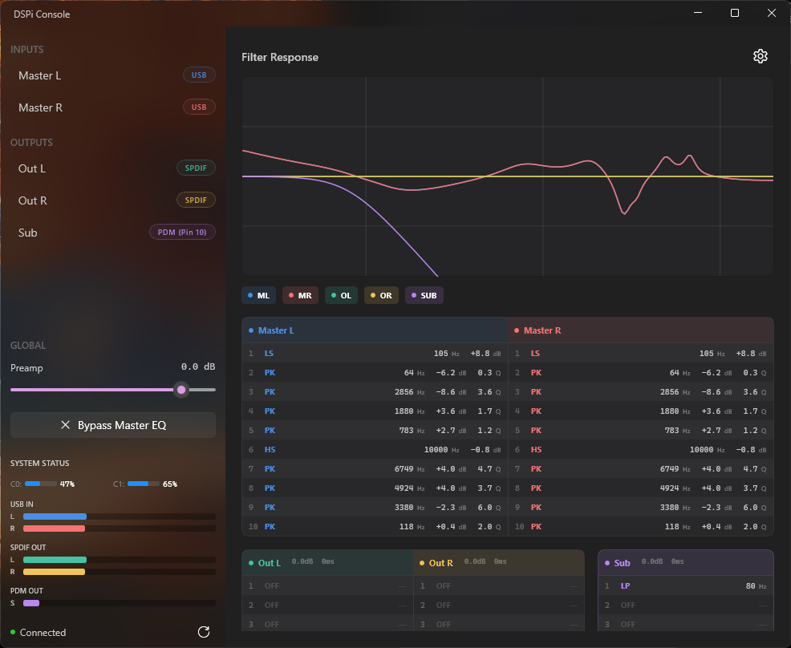

# DSPi Console for Windows

A native WinUI 3 control application for the [DSPi audio processor](https://github.com/WeebLabs/DSPi), open source
DSP Firmware that turns a Raspberry Pi Pico (RP2040) or Pico 2 (RP2350) into a capable multi-output USB audio
interface with an onboard signal processor.

DSPi Console provides complete control over the device: parametric equalisation, active crossovers, routing, time
alignment, loudness compensation, headphone crossfeed, dynamics processing, bass enhancement, stereo upmixing,
physical control surfaces and hardware configuration, all applied live over USB and requiring no reflashing.



---

## Contents

- [Important: match Console and Firmware versions](#important-match-console-and-firmware-versions)
- [Getting started](#getting-started)
- [The main window at a glance](#the-main-window-at-a-glance)
- [Feature reference](#feature-reference)
- [Keyboard shortcuts](#keyboard-shortcuts)
- [Settings](#settings)
- [Troubleshooting](#troubleshooting)
- [Building from source](#building-from-source)
- [Project structure](#project-structure)
- [Related projects](#related-projects)
- [License and acknowledgements](#license-and-acknowledgements)

---

## Important: match Console and Firmware versions

**Run Console and Firmware at exactly the same version, including the same beta or hotfix suffix, unless a
particular release explicitly states otherwise.**

Console and Firmware share a private USB control protocol that evolves with each release. New parameters,
new wire layouts and new bulk-transfer sections are introduced together on both sides. Mixing versions is not a
supported configuration, and the consequences range from the merely confusing to the potentially damaging:

- Features silently disappear from the interface because the device does not answer the capability probe for them.
- Values are written to the wrong field, so a control that should set a frequency may set a gain instead.
- Bulk configuration reads are misparsed, which can leave the interface misrepresenting the state of the device.

Every release of DSPi Console names the Firmware version against which it is built, and every Firmware release
names the Console version that accompanies it. Update both together, and consult the release notes beforehand: if
a release is compatible with a wider range of versions, it will say so.

Console degrades gracefully where it can. It probes the device for each capability at connection time and hides
the controls the connected device's Firmware cannot support, rather than issuing commands the device would reject.
This behaviour is a mitigation, not a substitute for matched versions. When the connected device's Firmware differs
from the version Console expects, a banner across the top of the window says so and links to the matching release;
it can be hidden until Console is next started.

Firmware releases are published in the [DSPi Firmware repository](https://github.com/WeebLabs/DSPi/releases), and
Console releases on [this repository's releases page](https://github.com/WeebLabs/DSPi-Console-Windows/releases).

---

## Getting started

### 1. Requirements

**Hardware**

- A Raspberry Pi Pico (RP2040) or Pico 2 (RP2350) running DSPi Firmware, together with the DACs, amplifiers and
  optical receivers appropriate to your installation. The
  [Firmware repository](https://github.com/WeebLabs/DSPi) documents the wiring, the default GPIO assignments and
  the signal chain in detail.
- A USB cable that carries data. Charge-only cables will not enumerate the device.

**Software**

- Windows 10 version 1809 (build 17763) or later, 64-bit.
- The [.NET 8 Desktop Runtime](https://dotnet.microsoft.com/download/dotnet/8.0). The Windows App SDK is bundled
  with the application, so this is the only prerequisite you need to install yourself.

### 2. Install Firmware

If your device is new, or if you are updating to match a new Console release:

1. Download the `.uf2` Firmware image for your board from the
   [DSPi releases page](https://github.com/WeebLabs/DSPi/releases). RP2040 and RP2350 builds are separate files;
   ensure you select the one that matches your board.
2. Put the board into bootloader mode. On a new board, hold the BOOTSEL button while connecting it to USB. If
   DSPi is already running and Console can see the device, use **File > Update Firmware**, which reboots it into
   the bootloader without requiring physical access to the button.
3. The board appears as a removable drive named `RPI-RP2` or similar. Copy the `.uf2` file onto it. The board
   reboots automatically once the copy completes.

### 3. Install Console

1. Download the latest `DSPi.Console.v<version>.zip` from the
   [releases page](https://github.com/WeebLabs/DSPi-Console-Windows/releases), choosing the release that matches
   your Firmware version.
2. Extract the archive to a location of your choosing. The application is portable and requires no installer.
3. Run `DSPiConsole.exe`.

### 4. Connect

Connect the device and launch Console. Detection is automatic: the title bar shows the connected device, and
the sidebar populates with the input and output channels your platform provides. If more than one DSPi device is
attached, a selection dialog appears.

Windows also presents the device as a standard USB audio interface. Select it as your playback device in the
Windows sound settings, and choose the desired format in the device's advanced properties. The number of input
channels Console displays follows the format Windows is streaming, so an eight-channel format yields eight
independently processed input channels.

### 5. Your first adjustments

**Equalise a channel.** Click a channel in the sidebar to open its editor. Each channel provides ten parametric
bands. Choose a filter type from the dropdown, then set the frequency, Q and gain. Values accept typed entry,
respond to the scroll wheel while Ctrl is held, and reset to their default on a right-click. The graph updates
continuously, and every change is applied to the device immediately. Click the channel again to return to the
dashboard.

**Or shape it on the graph.** On a channel page, each band appears as a coloured dot on the response graph.
Double-click empty graph to add a bell, drag a dot to move it, and scroll over it to change its width. See
[Editing filters on the graph](#editing-filters-on-the-graph).

**Build a crossover.** On an output channel, switch to the crossover tab. Each output provides four crossover
bands, each configured by family (Linkwitz-Riley, Butterworth or Bessel), type (low pass or high pass) and slope.
This is the configuration required to drive an active two-way or three-way system directly from the device's
outputs.

**Route your signal.** Open the matrix mixer with Ctrl+Shift+M. Rows are inputs, columns are outputs, and each
crosspoint carries an independent gain and a phase invert. Routing both input channels to a single output at
-6 dB, for example, produces a summed mono feed suitable for a subwoofer. Per-output gain, delay, mute and enable
controls sit alongside the matrix, and channels can be renamed to reflect their role in your system.

**Align your speakers.** Per-output delay is set in milliseconds from the matrix mixer or the channel editor.
Firmware compensates automatically for the differing latencies of the S/PDIF, I2S and PDM output paths, so the
values you enter correspond to acoustic delay.

**Save your work.** Adjustments are applied to the device immediately, but they reside in volatile memory until
you save them. Press Ctrl+S, or use **File > Save Preset**, to commit the current configuration to one of the
device's ten preset slots so that it survives a power cycle. An asterisk beside the preset selector indicates
unsaved changes. **File > Revert Preset** discards them and reloads the stored version, and **File > Factory
Reset** returns the device to its defaults.

---

## The main window at a glance

- **Sidebar.** Lists the inputs at the top and the outputs beneath. Selecting a channel opens its editor;
  selecting it again returns you to the dashboard. Input pairs can be linked so that edits apply to both halves of
  a stereo pair at once. Each channel carries a colour that identifies its trace on the graph.
- **Dashboard.** The default view, which presents one card per channel or channel pair, summarising the filters in
  use along with live gain, delay and mute state.
- **Graph.** A hardware-accelerated frequency response plot, rendered with Win2D, that shows the combined response
  of every visible channel. Visibility pills below the plot toggle individual channels and retain their state
  between sessions. Opening a channel editor narrows the graph to that channel; returning to the dashboard
  restores your saved configuration. The graph can also be detached into its own window, which optionally follows
  the selected channel.
- **Toolbar.** Provides direct access to the matrix mixer, settings, loudness compensation, crossfeed,
  psychoacoustic bass, the volume leveller, the statistics window and the master EQ bypass. Left-clicking a
  processing icon toggles the feature; right-clicking opens its settings window.
- **Preset selector, source selector and master volume.** These occupy the foot of the window, and comprise the
  active preset slot with its dirty indicator, the input source (USB, S/PDIF, I2S or ADAT, according to what the
  hardware supports), and the device-side master volume.

---

## Feature reference

### Parametric equalisation

- Ten parametric bands per channel, on every input and every output.
- Filter types: peaking, low shelf and high shelf at both 6 dB and 12 dB per octave, low cut and high cut at both
  6 dB and 12 dB per octave, notch, all pass at 6 dB and 12 dB per octave, and Linkwitz Transform.
- Per-band bypass, so a band can be taken out of circuit without losing its settings.
- Linkwitz Transform is offered on output channels only, as it exists to reshape a sealed-box driver's roll-off.
  Its four parameters (driver f0 and Q0, target fp and Qp) are edited in a popover with Cancel and Apply buttons,
  so a partially entered value is never applied to your speakers. The popover reports the resulting DC boost as
  the parameters are edited.
- Input channels can be linked so that a single edit applies to both halves of a stereo pair.

### Editing filters on the graph

On a channel page you can create and shape the parametric bands directly on the response graph, much like a modern
plug-in EQ. Every change reaches the device as you make it, the band list below follows along, and the change is
saved into the channel when you let go.

Each band appears as a dot in its own colour, the same colour as its number and bypass dot in the band list, with a
soft fill showing what that band contributes. Only the dot takes clicks: a click on a fill behaves as a click on
empty graph, so a new band can be placed anywhere. Editing is available when a device is connected and the
channel's curve is visible. It pauses while the crossover tab is open, since crossover bands are edited there, and
in the pop-out graph when it does not follow the main window's selection. On a linked input pair, every edit is
copied to the partner channel. With **Gain affects displayed level** on (Settings, Graphing), the curve includes the
channel's output gain or input preamp, and the dots and fills move with it, so they stay on the curve. Band values are
always the band's own: a band placed at a point takes the gain that puts its dot there.

- **Adding bands.** Double-click empty graph to add a bell at the pointer's frequency and level. Ctrl-click to open
  a card of shapes: pick a shape, then its slope where it has two (6 or 12 dB, or 180 or 360 degrees for an all
  pass). Or press on the curve itself and pull: a new band is drawn out of it, a low shelf near the left edge, a
  high shelf near the right and a bell elsewhere. New bands take the lowest band that is off; when every band is in
  use the graph says so.
- **Selecting.** Click a dot to select it, Ctrl-click to add or remove it, Shift-click to take every band between,
  in frequency order. Drag across empty graph to select the dots inside a box. Clicking a band's number in the list
  selects it too, with the same modifiers. Ctrl+A selects every band and Tab steps through them.
- **Dragging.** Drag a dot to change frequency and gain. A 12 dB cut's height is its resonance (Q); notches, all
  passes and 6 dB cuts move in frequency only. Several selected bands move together. Hold Shift for fine movement,
  Alt to lock to one axis, or Ctrl from the start to change Q instead. Pressing Ctrl after a drag has begun scales
  the selection's gains in proportion rather than moving them by the same number of decibels. Alt-click a dot to
  bypass it.
- **Scroll wheel.** Over a dot or its fill, the wheel changes Q and Ctrl-wheel changes gain; Shift gives finer
  steps. With bands selected, the wheel adjusts the selection. Over the dB labels at the left edge, the wheel zooms
  the graph's range.
- **The band chip.** A small card beside the dot shows the band's shape, frequency, gain and width. Drag a value
  up or down, scroll over it, or double-click it to type. Frequency accepts Hz, kHz ("2k") and note names ("A4",
  "C#2+13"). Tab moves to the next value. The shape button turns the card to a page of shapes and slopes, and the
  power button bypasses the band.
- **Menus and keys.** Right-click a dot for slope, bypass, invert gain and delete; right-click empty graph to select
  or deselect everything. Delete removes the selected bands, Escape deselects, the left and right arrows move them
  by a semitone, and up and down change their gain (Alt-up and Alt-down change Q).

The gear at the graph's top right opens its options: **Graph Setup** (scale, grids, the pointer readouts, grid
opacity, line width, glow and phase) and **Pop Out Graph**.

### Crossovers

- Four crossover bands per output channel, independent of the parametric bands.
- Linkwitz-Riley at 12, 24, 36 and 48 dB per octave.
- Butterworth from 6 to 48 dB per octave in 6 dB steps.
- Bessel at 12, 24, 36 and 48 dB per octave.
- Family, type and slope are chosen from separate pickers, which reduces the common case (a Linkwitz-Riley
  fourth-order pair at a given frequency) to a small number of selections.

### Output limiter

Each output has a brickwall lookahead peak limiter (firmware 1.1.6 beta 4 or later). Its icon, a gauge with a
needle, sits under the mute button on the output's page: grey when off, the accent colour when on, and orange while
it is reducing gain. Click the icon to switch the limiter on or off; right-click it for the settings.

- **Threshold:** the ceiling in dBFS, from -30 to 0 (default -1, which leaves room for the overshoot a DAC can
  produce between samples). The limiter runs after every gain stage, so no sample leaves the output above it.
- **Release:** how fast the gain recovers after a peak, 10 to 1000 ms (default 100).
- **Link group:** outputs in the same group (1 to 4) act as one limiter. They share on/off, threshold and release,
  and each applies the deepest reduction any of them needs, so a stereo image cannot shift. An output joining a
  group takes on its settings.
- **Copy to all outputs** gives every output this one's settings, leaving the groups alone; **All outputs** links
  every stereo pair, unlinks them all, or switches every limiter off.

While any limiter is on, every output is delayed by 32 samples. The limiter settings follow the same persistence
setting as the output pins: saved with the preset, or kept device-wide and saved with Save Output Config.

### Matrix mixer

- A full routing matrix from every input channel to every output channel, with independent gain and phase invert
  at each crosspoint.
- Per-output gain, delay, mute and enable.
- Editable channel names that propagate throughout the interface, including the dashboard, the graph legend and
  the control surface binding targets.
- A safety interlock warns before you enable outputs that contend for the same hardware resource.
- Disabled output columns are dimmed and inert, making the reason for a silent channel immediately apparent.

### Loudness compensation

Loudness compensation applies volume-dependent equalisation derived from the ISO 226 equal-loudness contours,
restoring the bass and treble that the ear loses at low listening levels. The reference SPL and the strength of the
correction are both adjustable, the resulting curve is drawn live, and on Firmware that supports it you may choose
precisely which output channels receive the compensation.

### Headphone crossfeed

Crossfeed applies a BS2B-derived process, with optional interaural time delay, that softens the unnaturally wide
channel separation of headphone listening. Three classic presets are provided (Default, Chu Moy and Jan Meier)
along with a custom mode that exposes the cutoff frequency and feed level directly. The set of output pairs that
receives crossfeed is selectable on Firmware that supports it.

### Volume leveller

The volume leveller is an RMS-based, soft-knee upward compressor that lifts quiet passages toward a target level
without ever making loud passages louder. Controls cover the amount, the speed (slow, medium or fast), the maximum
gain it is permitted to apply, a gate threshold below which it remains inactive, and an optional 10 ms lookahead
for improved transient handling. The channels that feed the shared level detector and the channels to which the
resulting gain is applied are selected independently.

### Psychoacoustic bass

Psychoacoustic bass provides missing-fundamental enhancement for small speakers, synthesising a harmonic series
that the ear interprets as bass the driver cannot physically reproduce. The cutoff frequency, harmonic level,
clipper drive, even-to-odd harmonic character and the amount of original bass retained are all adjustable, with
starting-point presets and per-output selection.

### Stereo upmixer

The upmixer derives centre and surround channels from a stereo source on RP2350 devices. Centre and surround
extraction each offer two engine modes (Sinner and Logician) with their own conditioning controls: extraction
strength, centre width, presence, correlation threshold, attack and release, detector bass cut, surround delay,
high-pass and low-pass filtering, and decorrelation. A live telemetry strip shows the measured correlation and
explains why the upmixer is parked whenever it is not producing output. Controls that do not apply to the current
mode are hidden rather than greyed out, and the matrix mixer labels the derived rows while the upmixer runs.

### Test signal generator

The test signal generator runs on the device itself, and produces sine and square tones, white and pink noise, and
logarithmic, linear or stepped sweeps for calibration and troubleshooting. The target channels and the level are
both selectable. The generator can optionally bypass the DSP chain entirely, which is useful for verifying an
output path in isolation, decorrelate the channels, or step through one channel at a time. Because it runs on the
device, it exercises the entire output path rather than the host playback stack alone.

### Control surfaces

Control surfaces bind physical controls attached to the device's spare GPIO pins to DSP parameters, so that the
device can be operated without a computer. Supported control types are buttons, switches, potentiometers, rotary
encoders, plain LEDs, PWM LEDs, infrared receivers and I2C character or OLED displays. Each binding pairs a
control with a parameter and an action: absolute adjustment, stepped increment or decrement, toggle, set, follow,
momentary, trigger, or one of the LED indicator behaviours. Parameters include volume, mute, preset selection,
input source, the processing blocks, per-output gain and delay, individual filter parameters, and CPU load. A
dimmable LED can also carry a brightness limit, which scales its whole range rather than clipping the top of it,
so a panel of mismatched indicators can be evened out. Infrared remotes are handled by a learning mode that
captures NEC, RC5 and RC6 codes directly from the handset, and a learned key can drive a channel group as well as
a single channel. Channel targets are presented using your own channel names. Control surfaces, channel groups
and macros are edited under Settings > Control.

A display is wired to a pair of I2C pins and shows what the device is doing. Whatever a control can drive, a page
can show, including channel groups. The panel can rest on one page, cycle a chosen set of them, or cycle
everything the device has, and whatever it is resting on, a parameter that just changed pops up for a moment
before it returns. Pages carry the value in large text or behind a level bar on the panels that can draw one, and
each of the two lines is placed left, centre or right. With a button and an encoder the panel also becomes a
front-panel editor: one control browses pages, another arms editing, and the first then adjusts whatever is on
screen until the editing timeout disarms it again.

### Input sources and hardware configuration

The device is not limited to USB. Depending on your hardware and Firmware, the input source selector offers USB,
S/PDIF, I2S and ADAT, and the settings window provides a page for each:

- **Main Outputs** assigns a GPIO pin to each output, with duplicate detection and conflict warnings.
- **Master Clock** holds what every interface shares: the default sample rate the device generates as clock master,
  and the master clock supplied to external DACs, with the pin it is generated on and its multiplier.
- **ADAT** configures both directions of the optical link on RP2350 devices: the eight-channel output and the
  eight-channel input, each with its enable and data pin, plus which end of the incoming lightpipe owns the clock
  and whether it is locked.
- **I2S** covers the whole interface, input and output together because they share the clocks: master or slave with
  a lock indicator, the bit and word clock pins, the optional separate pair for slave mode, and the multichannel
  input's channel count and per-pair data pins.
- **S/PDIF** configures the receiver, including multiple selectable instances on Firmware that supports them,
  and LG Sound Sync, which decodes volume and mute messages sent by LG televisions over TOSLINK.
- **External Mute Control** drives a DAC's hardware mute pin, so that muting produces true silence rather than a
  low signal level.
- **Control Interfaces** configures the device's UART and I2C interfaces.

### Presets and files

- **Device presets.** Ten slots on the device, each with a user-defined name. Save with Ctrl+S, revert to the
  stored version, or choose which slot loads at startup. Master volume and the physical output configuration can
  each be stored globally or as part of each preset, according to your preference.
- **Preset files.** The entire device configuration can be exported to a `.dspipreset` file, which may then be
  imported at a later date or onto another device. A preset file carries the input preamps, volumes, input source,
  loudness, crossfeed, volume leveller, psychoacoustic bass, upmixer, every channel's name, delay, gain, mute and
  enable state along with its EQ and crossover bands, every matrix crosspoint, and the physical I/O wiring. Volume
  levels and I/O configuration are separate options when importing, disabled by default, and anything the
  connected device cannot accept is reported rather than discarded silently.
- **Filter files.** Filter sets can be imported and exported in the DSPi multi-channel text format or in Room EQ
  Wizard (REW) format, which allows a measured room correction to be applied directly. A channel selection dialog
  determines the channels to which an imported file is applied.
- **AutoEQ.** Search the AutoEQ database of over a thousand headphone measurements and apply a profile together
  with its recommended preamp adjustment in a single step. Frequently used models can be kept in a favourites
  menu, and the bundled database can be refreshed from within the application.

### Monitoring and diagnostics

- Peak metering on every channel, with clip indication.
- Per-core CPU load, which indicates the processing headroom remaining.
- The statistics window (Ctrl+Shift+T) reports the platform, Firmware version and serial number, the system clock,
  core voltage, sample rate and temperature, PDM and S/PDIF error counters, USB audio ring statistics, and buffer
  fill levels with high and low watermarks that can be reset on demand.
- A bulk endpoint monitor (Ctrl+Shift+I) decodes the raw control traffic between Console and the device. It is
  primarily a development aid, but it is also valuable when diagnosing an unusual configuration.

---

## Keyboard shortcuts

| Shortcut | Action |
|----------|--------|
| Ctrl+I | Import filters |
| Ctrl+E | Export filters |
| Ctrl+S | Save preset |
| Ctrl+Shift+B | Browse AutoEQ profiles |
| Ctrl+Shift+M | Matrix mixer |
| Ctrl+Shift+L | Loudness compensation |
| Ctrl+Shift+X | Crossfeed |
| Ctrl+Shift+P | Psychoacoustic bass |
| Ctrl+Shift+U | Stereo upmixer |
| Ctrl+Shift+V | Volume leveller |
| Ctrl+Shift+G | Test signal generator |
| Ctrl+Shift+T | Statistics |
| Ctrl+Shift+I | Bulk endpoint monitor |
| Alt+F4 | Exit |

The tool-window letters match DSPi Console for macOS. Preset files are imported and exported from the File menu.

Numeric fields throughout the application share the same conventions: type a value directly, hold Ctrl and scroll
to adjust it, or right-click to reset it to its default.

---

## Settings

The settings window is organised into sections:

- **General > Globals.** Determines whether master volume is stored globally or per preset, whether the device
  loads its default preset or the last used preset at startup, and whether the output configuration travels with
  presets or is saved independently.
- **Graphing > Style, Scale and Grid & Labels.** Control the appearance of the frequency response plot, including
  its frequency and amplitude ranges, gridlines, labels, and whether inactive channels are drawn as dotted traces.
- **System.** Covers output pin assignment, the master clock, and the ADAT, I2S and S/PDIF interfaces, as
  described above.
- **Control > Macros, Channel Groups and Control Surfaces.** Build sequences of delayed parameter changes, name
  sets of channels that one control drives together, and bind physical controls and an IR remote to DSP
  parameters. Also covers the UART and I2C control interfaces and external mute control.
- **Presets > UI.** Determines how presets are presented in the main window.
- **Advanced > Debug.** Provides diagnostic options intended for development and for investigating unexpected
  behaviour.
- **About.** Shows the application version, the platform and the Firmware version reported by the connected device.

Settings that must be written to the device are staged rather than applied piecemeal. The settings window shows a
count of pending device changes, which you may then either save to the device's flash or discard.

---

## Troubleshooting

**Console reports that no USB devices are visible to libusb.** The DSPi vendor interface has not been bound to
the WinUSB driver. Assigning WinUSB to the vendor interface with a tool such as Zadig resolves this. Note that
this applies to the vendor control interface only, and does not affect the standard USB audio interface that
Windows uses for playback.

**Controls or entire windows are missing.** Console hides any feature for which the connected device's Firmware
does not report support. This is almost always a version mismatch: confirm that the Firmware version matches the
Console version, including any beta or hotfix suffix.

**The device is not detected at all.** Verify that the cable carries data, that the device enumerates as a USB
audio interface in the Windows sound settings, and that Firmware has finished flashing (a board left in
bootloader mode presents itself as a removable drive rather than an audio device).

**Changes are lost after a power cycle.** Adjustments are applied live but are not persistent until saved. Press
Ctrl+S to write the current configuration to a preset slot.

---

## Building from source

Requirements:

- .NET 8 SDK
- Visual Studio 2022 with the .NET Desktop Development workload and the Windows App SDK C# components

```bash
dotnet build -p:Platform=x64
```

The platform must be specified explicitly: the default `AnyCPU` configuration fails because the Windows App SDK
requires an explicit runtime identifier. This project targets x86_64 only.

Alternatively, open `DSPiConsole.sln` in Visual Studio 2022 and build with Ctrl+Shift+B.

---

## Project structure

```
DSPiConsole-Windows/
├── DSPiConsole/                        # WinUI 3 application
│   ├── MainWindow.xaml(.cs)            # Sidebar, dashboard, channel and crossover editors, graph
│   ├── MatrixMixerWindow.xaml(.cs)     # Routing matrix and per-output controls
│   ├── GraphWindow.xaml(.cs)           # Detachable frequency response plot
│   ├── LoudnessWindow.xaml(.cs)        # ISO 226 loudness compensation
│   ├── CrossfeedWindow.xaml(.cs)       # BS2B headphone crossfeed
│   ├── VolumeLevellerWindow.xaml(.cs)  # Upward compression
│   ├── PsychoacousticBassWindow.xaml(.cs)
│   ├── UpmixerWindow.xaml(.cs)         # Stereo to centre and surround upmixing
│   ├── TestSignalsWindow.xaml(.cs)     # Onboard signal generator
│   ├── ControlSurfacesWindow.xaml(.cs) # GPIO and infrared control bindings
│   ├── StatsWindow.xaml(.cs)           # Telemetry and buffer statistics
│   ├── BulkMonitorWindow.xaml(.cs)     # Control traffic decoder
│   ├── Settings/                       # Settings shell, registry and pages
│   ├── Controls/                       # Bode plot, meters, CPU display
│   ├── Dialogs/                        # AutoEQ browser, channel pickers
│   ├── Services/                       # Filter and preset file handling, AutoEQ database
│   └── ViewModels/                     # Application state and device commands
├── DSPiConsole.Core/                   # Platform-independent models and DSP mathematics
│   ├── Models/                         # Channels, filters, crossovers, control surfaces, status
│   └── DspMath.cs                      # Biquad and crossover coefficient calculation
└── DSPiConsole.Usb/                    # USB transport
    ├── DspDevice.cs                    # Vendor control protocol over LibUsbDotNet
    └── BulkParamsParser.cs             # Bulk configuration decoding
```

---

## Related projects

- [DSPi](https://github.com/WeebLabs/DSPi): Firmware itself, along with the hardware documentation, the signal
  chain reference and the USB control protocol specification.
- [DSPi Console for macOS](https://github.com/WeebLabs/DSPi-Console): the macOS application.
- [DSPi Console for Linux](https://github.com/WeebLabs/DSPi-Console-Linux): a Qt and Rust port for Linux.
- [dspictl](https://github.com/WeebLabs/dspictl): command line control, which is useful for scripting and
  automation.
- [DSPiCliRemote](https://github.com/WeebLabs/DSPiCliRemote): web- and application-based remote control.

The [official Discord server](https://discord.gg/RCyqxAQ5xS) is the best place for development updates,
discussion and assistance.

---

## License and acknowledgements

Released under the GNU General Public License v3.0.

- Headphone correction profiles are drawn from the [AutoEQ project](https://github.com/jaakkopasanen/AutoEq).
- Crossfeed is derived from the BS2B algorithm.
- Loudness compensation follows the ISO 226:2003 equal-loudness contours.
